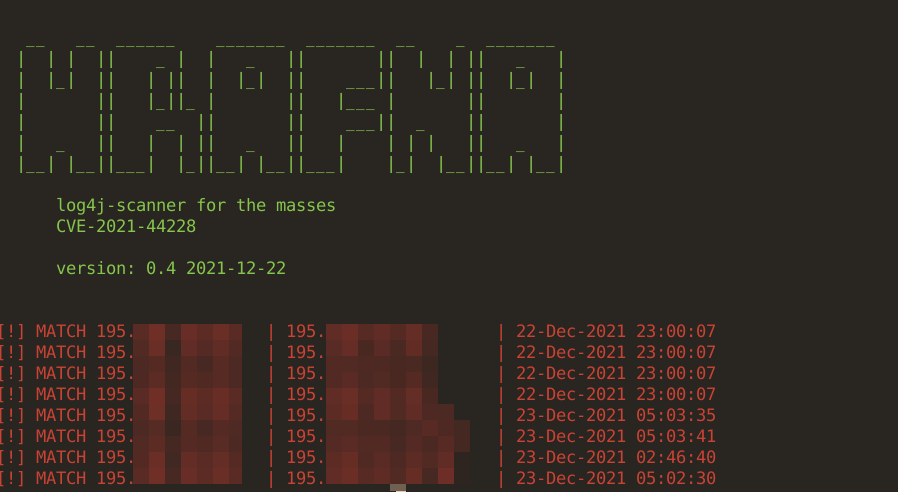
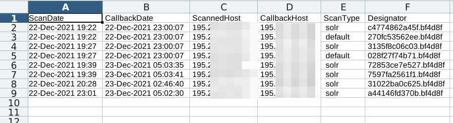

### Hrafna - Log4j-Scanner for the masses 

Features 

- Scanning-system designed to check your own infra for vulnerable log4j-installations
- start and stop scans ([CTRL-C] is your friend), continue and skip already tested
- use your own DNS-server that listens to Requests from scanned hosts
- unique requests for each host to be scanned 
- easy to correlate which host sends a callback
- reportmode to see which hosts made a callback
- adjustable fields for the payload for app-specific/customized attackpatterns

### unique requests

- each payload is unique, so you can see which host triggered
  a response or maybe backend-system were connected 

~~~

PAYLOAD: e3a4d77618a0  .  3c028d   .  l4s.scanix.edu
         ^^^              ^^^         ^^^
         host_id          scan_id     your custom nameserver

~~~

### install

- install packages from requirements.txt
- instructions for the BIND-setup are below 

### config

- l4s.scanix.edu is our example here, change according to your own needs 

- global_config

~~~

global.yaml

base_scan_domain: l4s.scanix.edu
bind_log: /var/log/bind/hrafna.log

~~~

- each scan has a unique config-file in yaml-format

~~~

scan.yaml

name: your_scan_name
mode: default
input_file: hostnames.txt

# 

~~~

- name: give your scan a name (alphanum, spaces will get converted to "_"
- mode:
    - see payloads/*.yaml for more specific payloads
    
    - default: (currently the only mode, but more will get added as new
      attackvectors are dropping in)
    - all: getting all available payloads
    - additional: currently in private mode (6 apps and counting)
      
- input_file: your file with targets (IPs or hostnames), full urls
  including ports preferred, otherwise only https://target/ is checked

~~~
# default.yaml

url:  /?id={{PAYLOAD}}
headers:
  - "User-Agent: {{PAYLOAD}}"
  - "X-Request-ID: {{PAYLOAD}}"
  - "Referer: {{PAYLOAD}}"

~~~

optional:

~~~

# waf_bypass: True | False (tbd)
# headers: headers.txt (tbd) which headers_file to use, must be available in libs/  

~~~

### run

~~~

./hrafna scan scan.yaml    -> execute/continue a scan, requests
                              are stored in output/scan_name/global.log

./hrafna report scan.yaml  -> check sended request against
                              your BIND-log (see global.log)

./hrafna reset scan.yaml   -> copy a scan to output/scan_name.TIMESTAMP
                              allows you to execute another scan

~~~

### output and reports

- output for each scan is stored in `output/scan_name/scan_name-matched.csv`

# Setup the scanner and BIND

- have your dns-server and your scanner on the same maschine for auto_reports
  (scanner neesd to read the bind-logfile)
  

  

# your bind config

- GOTO DNS-Zonefile of your scanning domain (scanix.edu)

~~~

l4s		IN	A	    1.2.3.4
l4s		IN	AAAA	2a01:::::1
l4s		IN	NS     	l4s

~~~

- local named.conf 

~~~

# named.conf.local

...

zone "l4s.scanix.edu." {
        type master;
        file "/etc/bind/l4s.zone";
};

logging {
  channel "querylog" {
    file "/var/log/bind9/hrafna.log";
    print-time yes;
  };
  category queries { querylog; };
};

...

~~~

- bind_zonefile  - change l4s.scanix.edu to your own domain / subdomain

~~~

# /etc/bind/l4s.zone

; l4s.scanix.edu
$TTL 60
l4s.scanix.edu. IN     SOA    a.root-servers.net. technik@zero.bs. (
                                2021121301  ; Serial
                                1H          ; refresh after 3 hours
                                30m          ; retry after 1 hour
                                1H          ; expire after 1 week
                                1D)         ; minimum TTL of 1 day

                                IN      NS      l4s.scanix.edu.

l4s.scanix.edu.                  IN A            1.2.3.4
l4s.scanix.edu.                  IN AAAA         2a01:4f8::::

*                               IN A            1.2.3.4           
*                               IN AAAA         2a01:4f8:::::

~~~

# Changelog

### 0.4 - 2021-12-22

- better report and csv-output

- bypasses and bypasses2
    - https://twitter.com/marcioalm/status/1471740771581652995

- scan_profiles
    - default / blind_shot
    - more are in private mode currently

### 0.2 - 2021-12-12

- first naive scanner
- evasions
- dns
- custom scan-hostnames

### 01. 2021-12-10

- internal release only 
